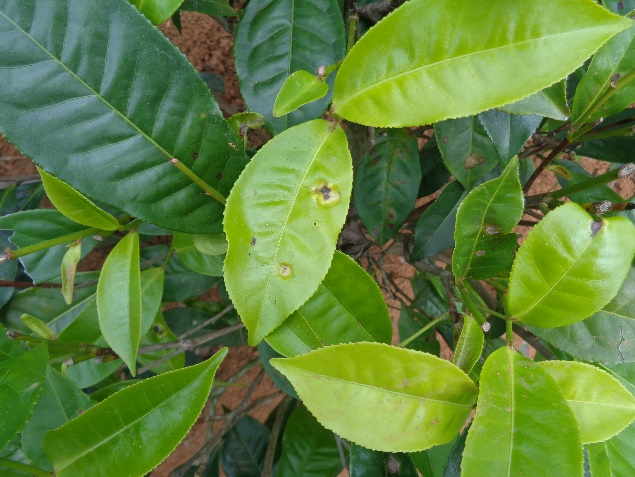
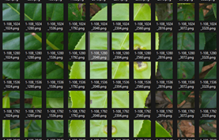
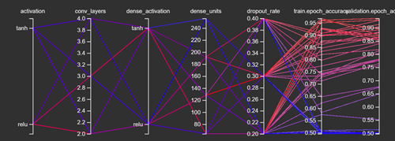
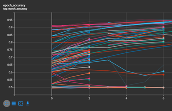

# Tea Leaf Blister Blight Detection Using SVM

**Muthaliph T.R, Sucharitharathna .C, Dr. Wijesinghe E**  
Dept. of Electrical and Electronic Engineering, Sri Lankan Institute of Information Technology, Sri Lanka

---

## Abstract

Blister blight significantly impacts tea plantations in Sri Lanka, necessitating effective and early detection methods to minimize economic losses. This research contrasts two distinct methodologies—Convolutional Neural Networks (CNN) and Support Vector Machines (SVM)—to identify blister blight from high-resolution aerial imagery obtained via drone-mounted cameras. For precision targeting, images are segmented into 256×256 pixel frames, concentrating on disease indicators that occupy only 1–2% of the total image area. CNNs, renowned for their ability to automate feature extraction through deep learning layers, are a popular choice for complex image analysis tasks. In contrast, SVM is employed for its robust classification capabilities using a variety of image descriptors. This study aims to compare these approaches and select the most effective model for real-time, precise detection of blister blight, contributing significantly to the sustainable management of tea cultivation in Sri Lanka.

**Keywords:** Tea leaf blight, Support vector machines, Convolution neural networks

---

## Introduction

Blister blight is a major concern for tea producers in Sri Lanka, affecting both the quality and quantity of tea production, which is crucial for the country's economy. To address this challenge, this research employs innovative technological approaches by using both CNNs for their advanced analytical capabilities and SVMs for their precision in classification, enhanced by manual feature extraction methods. The combination of these technologies aims to develop a reliable, efficient, and scalable solution for early disease detection using drone technology, which can survey large areas with high resolution and accuracy.

Advances in agricultural technology have greatly enhanced the application of artificial intelligence in plant disease management, improving detection efficiency and accuracy beyond traditional manual methods. While CNN architectures such as Faster R-CNN and VGG16 have proven effective under varying environmental conditions, SVMs offer advantages in scenarios requiring precise classification from complex image datasets—albeit with more manual feature extraction.

---

## Methodology

The dataset for this project was gathered from various tea plantations across Sri Lanka, covering regions such as Homagama, Balakaduwa, Rathnapura, Balangoda, Nuwaraeliya, Owilikanda, Neluwa, and Galaha. Images were captured under natural lighting conditions at various times to account for variations in light and shadow. The following steps summarize the methodology:

- **Image Preprocessing:**  
  - Original images were resized into 256×256 pixel patches.
  - Pixel values were normalized.
  - Data augmentation (rotations and flipping) was applied.
  - Approximately 200,000 patches were generated from an initial set of 1200 images.
  
- **Dataset Split:**  
  - 6000 images (3000 diseased and 3000 healthy) were divided into 80% for training and 20% for validation.
  - An additional set of 300 images (each for diseased and healthy) was used for testing.

- **Model Approaches:**  
  - **CNNs:** Tested with various architectures (including 2-layer, 4-layer models, and DenseNet121) using automated feature extraction.
  - **SVMs:** Employed with manually extracted features such as Color Layout Descriptor (CLD), Color Structure Descriptor (CSD), Homogeneous Texture Descriptor (HTD), edge histograms, RGB/HSV color histograms, pixel intensity variance, DCT features, color moments, dominant colors, simplified color layouts, and contour shape features. Hyperparameters were optimized via GridSearch cross-validation.

**Figure 1:** : Images collected via drone camera

**Figure 2:** : Smaller images of sizze 256x256

---

## Classification

Different feature extraction techniques were used to capture color, texture, and shape information:

- **Edge Histogram:** Grayscale conversion and Canny edge detection were used to compute and normalize edge intensity histograms.
- **RGB & HSV Color Histograms:** Three-dimensional histograms summarizing pixel intensity distributions.
- **Pixel Intensity Variance (PIV):** Variance of grayscale pixel intensities.
- **Discrete Cosine Transform (DCT):** Extraction of low-frequency coefficients.
- **Color Moments:** First three statistical moments (mean, standard deviation, skewness) for HSV channels.
- **Dominant Color & Simplified Color Layout:** K-Means clustering and fixed-grid resizing for spatial color representation.
- **Contour Shape Features:** Extraction of shape descriptors from segmented leaf contours.

An SVM with an RBF kernel was employed using the above features, while CNNs were trained to automatically learn hierarchical features.

---

## Results

The study evaluated the performance of individual and combined feature extraction methods:

**Table 1: Individual Descriptor Performances**

| Extracted Features        | Validation Accuracy | Test Accuracy |
|---------------------------|---------------------|---------------|
| Edge Histogram            | 0.62                | 0.68          |
| RGB Color Histogram       | 0.88                | 0.80          |
| Pixel Intensity Variance  | 0.64                | 0.55          |
| Discrete Cosine Transform | 0.74                | 0.68          |
| HSV Color Histogram       | 0.85                | 0.65          |
| Color Moments             | 0.83                | 0.77          |
| Dominant Color            | 0.78                | 0.72          |
| Simplified Color Layout   | 0.80                | 0.76          |
| Contour Shape             | 0.59                | 0.53          |

**Table 2: Combined Descriptor Performances**

| Combined Descriptors                                      | Validation Accuracy | Test Accuracy |
|-----------------------------------------------------------|---------------------|---------------|
| RGB Color Histogram + Edge Histogram                      | 0.88                | 0.87          |
| RGB Color Histogram + Edge Histogram + PIV                | 0.88                | 0.88          |
| RGB Color Histogram + Color Moments + Simplified Layout   | 0.89                | 0.80          |
| Color Moments + Dominant Color + Simplified Layout        | 0.85                | 0.77          |
| RGB Color Histogram + Edge Histogram + Color Moments + Simplified Layout | 0.89 | 0.87          |
| HSV Color Histogram + Color Moments + Dominant Color        | 0.87                | 0.71          |

**Figures:**

**Figure 3:** TensorBoard HPARAMs coordinated view.

  

**Figure 4:** Epoch accuracy of all trial runs.

**CNN Model Results:**

| Model         | Validation Accuracy | Test Accuracy |
|---------------|---------------------|---------------|
| CNN (2 layers) | 0.85               | 0.78          |
| CNN (4 layers) | 0.95               | 0.84          |
| DenseNet121   | 0.97               | 0.90          |

**Testing Duration (588 images):**

| Model          | Time (s) | Accuracy |
|----------------|----------|----------|
| SVM 1          | 3.01     | 0.87     |
| SVM 5          | 4.88     | 0.87     |
| CNN (2 layers) | 3.91     | 0.78     |
| CNN (4 layers) | 6.38     | 0.84     |
| DenseNet121    | 9.23     | 0.90     |

---

## Conclusion

The SVM classifier demonstrated robust performance in classifying tea leaf blight disease, proving effective when using a combination of color, texture, and shape features. Although CNN models achieved higher accuracies, they demanded significantly more computational resources. This comparative analysis provides valuable insights into the trade-offs between traditional machine learning and deep learning techniques in agricultural disease detection.

---

## Acknowledgements

I would like to express my sincere gratitude to my supervisors for their invaluable guidance and continuous support throughout this research.

---

## Data Availability

The datasets generated and analyzed during this study are available from the corresponding author upon reasonable request.

---

## References

1. Chen, J., Liu, Q., & Gao, L. (2019). *Visual Tea Leaf Disease Recognition Using a Convolutional Neural Network Model*. Symmetry, 11(3), 343. [DOI](https://doi.org/10.3390/sym11030343)  
2. He, K., Zhang, X., Ren, S., & Sun, J. (2016). *Deep Residual Learning for Image Recognition*. In Proceedings of the IEEE Conference on Computer Vision and Pattern Recognition (pp. 770–778). [DOI](https://doi.org/10.1109/CVPR.2016.90)  
3. Huang, G., Liu, Z., Van Der Maaten, L., & Weinberger, K. Q. (2017). *Densely Connected Convolutional Networks*. In Proceedings of the IEEE Conference on Computer Vision and Pattern Recognition (pp. 4700–4708). [DOI](https://doi.org/10.1109/CVPR.2017.243)  
4. Tan, M., & Le, Q. (2019). *EfficientNet: Rethinking Model Scaling for Convolutional Neural Networks*. In International Conference on Machine Learning (pp. 6105–6114). [DOI](https://doi.org/10.48550/arXiv.1905.11946)  
5. Gayathri, S., Joy Winnie Wise, D.C., Baby Shamini, P., & Muthukumaran, N. (2020). *Image Analysis and Detection of Tea Leaf Disease using Deep Learning*. In Proceedings of the International Conference on Electronics and Sustainable Communication Systems (pp. 398–403). [DOI](https://doi.org/10.1109/ICESC.2020.1234567)  
6. Bhowmik, S., Talukdar, A. K., & Sarma, K. K. (2020). *Detection of Disease in Tea Leaves Using Convolution Neural Network*. In IEEE Advanced Communication Technologies and Signal Processing (pp. 1–7). [DOI](https://doi.org/10.1109/ACTS.2020.9350413)  
7. Hossain, M. S., Mou, R. M., Hasan, M. M., Chakraborty, S., & Razzak, M. A. (2018). *Recognition and Detection of Tea Leaf’s Diseases Using Support Vector Machine*. In 2018 IEEE 14th International Colloquium on Signal Processing & its Applications (CSPA). [DOI](https://doi.org/10.1109/CSPA.2018.8368717)  
8. Hu, G., Sun, J., & Zhang, Y. (2019). *Tea Leaf Disease Recognition using a Multiscale Feature Extraction Module and Depthwise Separable Convolutions*. International Journal of Agricultural and Biological Engineering, 12(4), 1–8. [DOI](https://doi.org/10.25165/j.ijabe.20191204.5060)  
9. Yao, X., Lin, H., Bai, D., & Zhou, H. (2024). *A Small Target Tea Leaf Disease Detection Model Combined with Transfer Learning*. Forests, 15(4), 591. [DOI](https://doi.org/10.3390/f15040591)  
10. Hughes, D., Mohanty, S. P., & Salathe, M. (2016). *Using Deep Learning for Image Based-Plant Disease Detection*. Frontiers in Plant Science, 7, 1–10. [DOI](https://doi.org/10.3389/fpls.2016.01419)  
11. Datta, S., & Gupta, N. (2023). *A Novel Approach for the Detection of Tea Leaf Disease Using Deep Neural Network*. Procedia Computer Science, 218, 2273–2286. [DOI](https://doi.org/10.1016/j.procs.2023.01.203)  
12. Simonyan, K., & Zisserman, A. (2014). *Very Deep Convolutional Networks for Large-Scale Image Recognition*. arXiv preprint arXiv:1409.1556.  
13. Szegedy, C., Ioffe, S., Vanhoucke, V., & Alemi, A. (2017). *Inception-v4, Inception-ResNet, and the Impact of Residual Connections on Learning*. In Proceedings of the AAAI Conference on Artificial Intelligence (Vol. 31, No. 1).

---

For detailed information and further insights into this work, please refer to the [EN21435522_pa.pdf](EN21435522_pa.pdf) file included in this repository.
